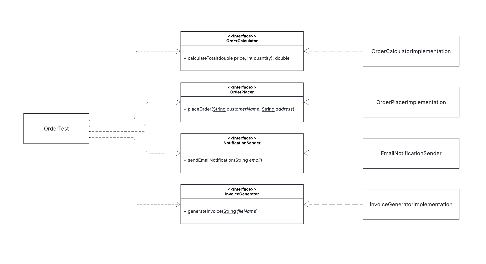

# SoftEng2_LabAssignment5_SOLIDPrinciples

## **Description**  
The original **Order Management System** violates **SOLID principles**, making it difficult to maintain and extend. A single class handles multiple responsibilities, causing **tight coupling** and **low cohesion**.  

### **Issues**  
- **SRP Violation:** One class manages calculations, order placement, invoices, and notifications.  
- **OCP Violation:** Adding new features requires modifying existing code.  
- **ISP Violation:** A single interface enforces unnecessary method implementations.  

### **Solution**  
- **Separate Concerns:** Define individual interfaces (`OrderCalculator`, `OrderPlacer`, `InvoiceGenerator`, `NotificationSender`).  
- **Modular Implementation:** Each function gets a dedicated class.  
- **Dependency Injection:** Improves flexibility and testability.  

## UML Diagram

